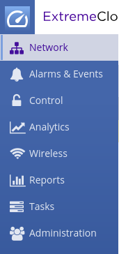
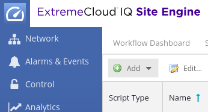
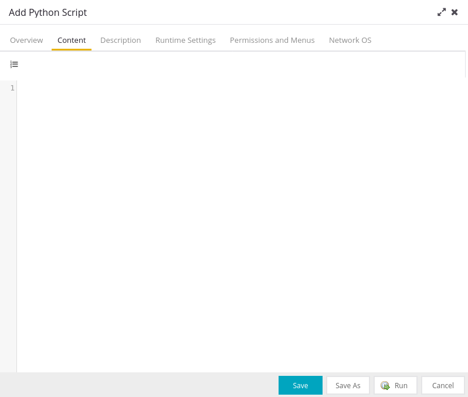
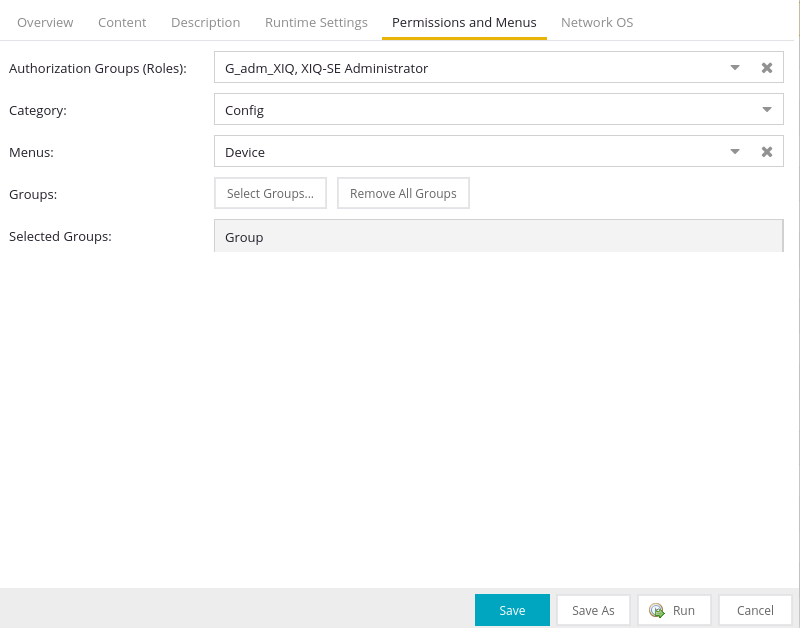
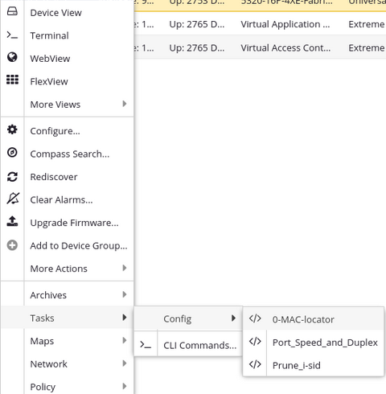
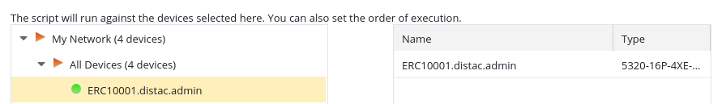
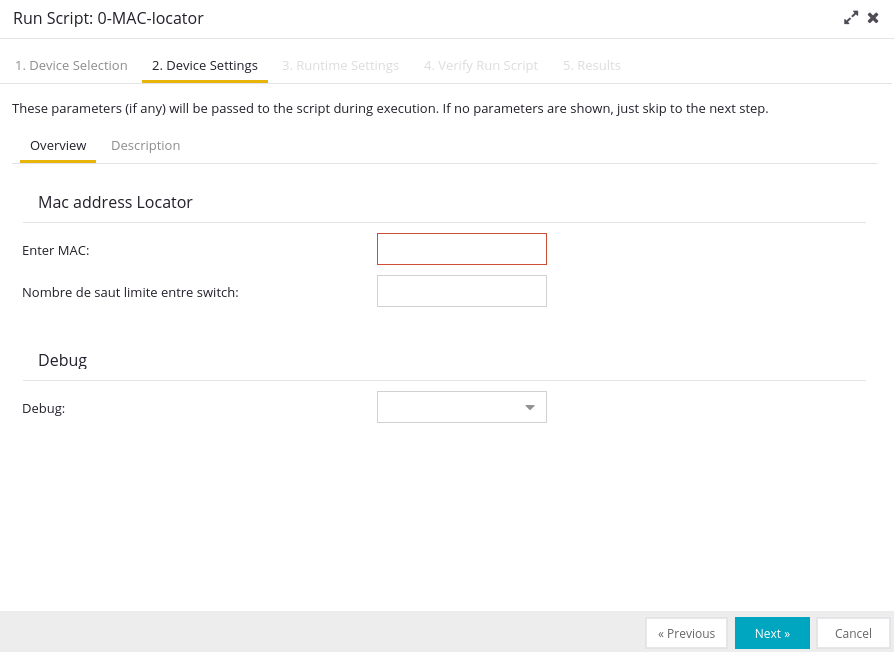
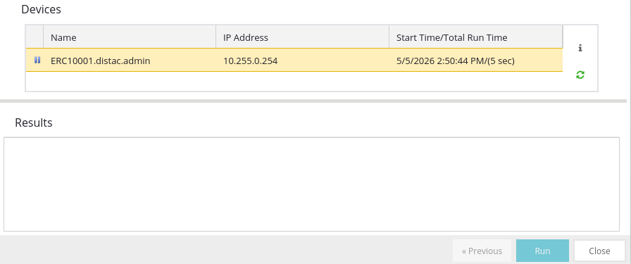

# MAC_address_Locator
Ce script a pour but de localiser une adresse MAC dans une fabric ExtremeCloudIQ en utilisant le SDK Python de Thibault Chevalleraud.
Le script interroge les tables MAC des switchs de la fabric pour trouver une adresse MAC cible et retourne le nom du switch et le port où elle est connectée.

## Installation

### Étape 1 : Télécharger le SDK
1. Rendez-vous sur le projet XIQSE-SDK de Thibault Chevalleraud sur son GitHub : [www.github.com/TChevalleraud/XIQSE-SDK-Python]
2. Exécutez les commandes données dans le README de Thibault dans un terminal pour installer le SDK et ses dépendances. Assurez-vous que le script a accès aux fonctions de Thibault. Pour cela, vous devez exécuter les commandes sur la VM où est hébergé SITE Engine, avec des droits d'accès pour créer un dossier dans le dossier Extreme_Networks.

### Étape 2 : Télécharger le projet
3. Téléchargez ou copiez le projet MAC_address_Locator.

### Étape 3 : Ajouter le script à ExtremeCloudIQ
4. Ajoutez le script `MAC_address_Locator.py` à vos scripts dans ExtremeCloudIQ en copiant ou en important le fichier. Pour cela, utilisez l'onglet "Task" et le bouton "Add" comme illustré ci-dessous :

     

5. Assurez-vous de donner les droits nécessaires pour que le script puisse exécuter des commandes CLI et GraphQL et dans "Menu" selectionnez "Device" pour que le script puisse être exécuté depuis les pages de vos switchs.
Selectionnez egalement un groupe dans lequel 

   

### Étape 4 : Exécuter le script
6. Pour executer le script, rendez-vous dans l'onglet Network, choisissez un switch sur lequel executer le programme (click droit), allez dans l'onglet Task, choisissez le groupe dans lequel vous)
vous avez ajouté le script, puis cliquez sur le script.

   

### Étape 5 : Entrer l'adresse MAC
7. Choississez un switch de départ et entrez l'adresse MAC que vous souhaitez localiser, le nombre de saut maximum (valeur par default 5) et le mode debug (non obligatoire).
    
     

### Étape 6 : Résultat
8. Le script vous retournera le nom du switch et le port où est connectée votre adresse MAC cible.

    

## Fonctions

### `execute_cli_command(command)`
Exécute une commande CLI simple et retourne la réponse brute.
- **param command** : Commande CLI à exécuter.
- **return** : Réponse brute de la commande.

**Exemple :**
```python
command = "enable"
output = execute_cli_command(command)
```

### `ask_debug()`
Regarde si l'utilisateur veut un debug en vérifiant la variable `userInputDebug`.
- **return** : retourne True ou False en fonction de ce que veut l'utilisateur

### `parse_mac_table_response(raw_response, mac_address)`
Cette fonction sert à vérifier si l'adresse MAC recherchée est présente dans la réponse brute de la commande CLI.
- **param raw_response** : Réponse brute de la commande CLI.
- **param mac_address** : Notre MAC address cible.
- **return** : retourne la ligne où est trouvée l'adresse MAC, ou None si non trouvée.

### `get_tunnel(line)`
La fonction permet de récupérer le tunnel associé à la ligne de la table MAC où est trouvée notre adresse MAC cible.
- **param line** : Ligne de la table MAC où est trouvée notre adresse MAC cible.
- **return** : Le nom du switch de la colonne tunnel, ou "LOCAL" si la MAC est locale.

### `execute_graphql(query_string)`
Exécute une requête GraphQL brute et retourne la réponse.
- **param query_string** : Requête GraphQL sous forme de string.
- **return** : Réponse de la requête GraphQL en dictionnaire/liste, ou None en cas d'erreur.

**Exemple :**
```python
raw_query = '''
    query {
        network {
            devices {
                ip
                sysName
            }
        }
    }
'''
raw_response = execute_graphql(raw_query)
print("GraphQL response: " + str(raw_response))
```

### `get_switch_ip(graphql_response, switch_name)`
Cette fonction sert à extraire l'IP du switch à partir de la réponse GraphQL en fonction du nom du switch.
- **param graphql_response** : Réponse GraphQL sous forme de dictionnaire/liste.
- **param switch_name** : Nom du switch à chercher.
- **return** : IP du switch trouvé, None ou message d'erreur si le switch n'est pas trouvé.

### `is_local(line)`
Cette fonction vérifie si la ligne rentrée contient le mot "LOCAL" ou "NON-LOCAL" pour déterminer si l'adresse MAC est en local sur le switch ou pas.
- **param line** : Ligne de la table MAC (format i-sid) où est trouvée notre adresse MAC cible.
- **return** : retourne 1 si LOCAL, 0 si NON-LOCAL, -1 en cas d'erreur d'index.

### `get_switch_prompt()`
Cette fonction envoie une commande vide pour simuler une pression sur la touche "entrée" et ainsi récupérer le prompt du switch. Elle est utilisée dans la fonction `is_local()`.
- **return** : Le prompt du switch (sans le préfixe ":1>").

### `entry_to_correct_format(user_input)`
Cette fonction permet de nettoyer l'adresse MAC donnée par l'utilisateur en supprimant tous symboles et en ne récupérant que les caractères hexadécimaux, puis reconstruit l'adresse MAC sous le format "XX:XX:XX:XX:XX:XX".
- **param user_input** : L'adresse MAC entrée par l'utilisateur (accepte n'importe quel format avec 12 caractères hex).
- **return** : L'adresse MAC formatée sous la forme "XX:XX:XX:XX:XX:XX", ou None si le format n'est pas valide.

### `clean_port(port)`
Fonction qui sert à nettoyer la sortie du port pour n'afficher que le numéro de port.
- **param port** : Port à nettoyer (peut être au format "port:X" ou "port-X").
- **return** : Port nettoyé (juste le numéro).

### `better_print(string)`
Fonction qui permet une meilleure lisibilité dans le terminal de ExtremeCloud en encadrant le texte avec des traits.
- **param string** : Une chaîne de caractère qui va être rendue plus lisible.


### `main()`
La fonction `main()` contient toute la logique pour localiser l'adresse MAC. Voici les étapes du main:
1. Elle récupère l'entrée de l'utilisateur et la nettoie
2. Entre dans une boucle (jusqu'à `jump_limit`) puis interroge le switch choisi au début pour savoir s'il connaît la MAC
3. Récupère la ligne où la MAC a été trouvée et extrait le tunnel associé
4. Si tunnel = "LOCAL", sort de la boucle (MAC trouvée en local sur le switch)
5. Sinon, utilise GraphQL pour récupérer l'IP du switch suivant via son nom
6. Ferme la connexion actuelle et se reconnecte au switch suivant
7. Incrémente le compteur de sauts et boucle
8. Après la boucle, le script vérifie que la MAC est bien en local avec la commande `sh i-sid mac-address-entry`
9. Il affiche les résultats (nom du switch, port) ou un message d'erreur
10. ET affiche le nombre de sauts effectués et un résumé debug si activé
