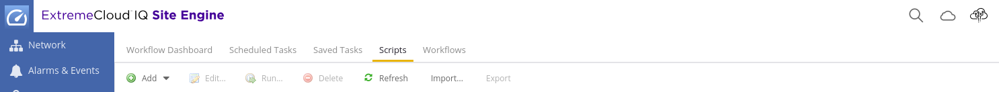
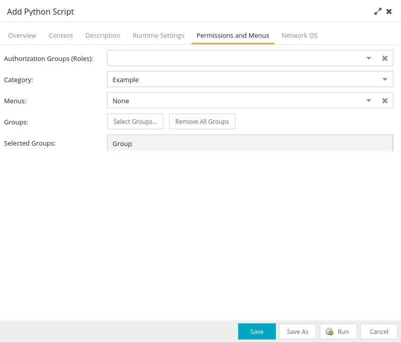
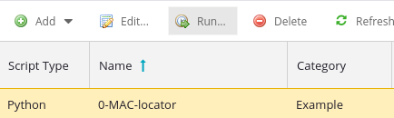
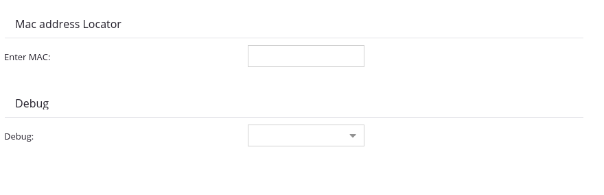

# MAC_address_Locator
Ce script a pour but de localiser une adresse MAC dans une fabric ExtremeCloudIQ en utilisant le SDK Python de Thibault Chevalleraud.
Le script interroge les tables MAC des switchs de la fabric pour trouver une adresse MAC cible et retourne le nom du switch et le port où elle est connectée.

## Installation

### Étape 1 : Télécharger le SDK
1. Rendez-vous sur le projet XIQSE-SDK de Thibault Chevalleraud sur son GitHub : [www.github.com/TChevalleraud/XIQSE-SDK-Python]
2. Exécutez les commandes données dans le README de Thibault dans un terminal pour installer le SDK et ses dépendances. Assurez-vous que le script a accès aux fonctions de Thibault. Pour cela, vous devez exécuter les commandes sur la VM où est hébergé SITE Engine, avec des droits d'accès pour créer un dossier dans le dossier Extreme_Networks.

### Étape 2 : Télécharger le projet
3. Téléchargez ou copiez le projet MAC_address_Locator.

### Étape 3 : Ajouter le script à ExtremeCloudIQ
4. Ajoutez le script `MAC_address_Locator.py` à vos scripts dans ExtremeCloudIQ en copiant ou en important le fichier. Pour cela, utilisez l'onglet "Task" et le bouton "Add" comme illustré ci-dessous :

     

5. Assurez-vous de donner les droits nécessaires pour que le script puisse exécuter des commandes CLI et GraphQL :

   

### Étape 4 : Exécuter le script
6. Exécutez le script en le sélectionnant et en cliquant sur "Run" :

   

### Étape 5 : Entrer l'adresse MAC
7. Choississez un switch de départ et entrez l'adresse MAC que vous souhaitez localiser.
    
     

### Étape 6 : Résultat
8. Le script vous retournera le nom du switch et le port où est connectée votre adresse MAC cible.

    

## Fonctions

### `is_local(line)`
Cette fonction vérifie si la ligne rentrée contient le mot "LOCAL" ou "NON-LOCAL" pour déterminer si l'adresse MAC est en local sur le switch ou pas.
- **param line** : ligne de la table MAC où est trouvée notre adresse MAC cible.
- **return** : retourne 0 ou 1 et un message pour indiquer si la MAC est locale ou non.

### `execute_cli_command(command)`
Exécute une commande CLI simple et retourne la réponse brute.
**Exemple :**
```python
command = "enable"
execute_cli_command(command)
```

### `execute_graphql(query_string)`
Exécute une requête GraphQL brute et retourne la réponse.
- **param query_string** : Requête GraphQL sous forme de string.
- **return** : Réponse de la requête GraphQL.

**Exemple :**
```python
raw_query = '''
    query {
        network {
            devices {
                ip
                sysName
            }
        }
    }
'''
raw_response = execute_graphql(raw_query)
print("GraphQL response: " + str(raw_response))
```

### `get_switch_ip(GraphQl_response, Switch_Name)`
Cette fonction sert à extraire l'IP du switch à partir de la réponse GraphQL en fonction du nom du switch.
- **param GraphQl_response** : Réponse GraphQL sous forme de dictionnaire/liste.
- **param Switch_Name** : Nom du switch.
- **return** : IP du switch ou message d'erreur si le switch n'est pas trouvé.

### `get_tunnel(line)`
La fonction permet de récupérer le tunnel associé à la ligne de la table MAC où est trouvée notre adresse MAC cible. Et vérifie si l'adresse MAC est en local sur le premier switch interrogé.
- **param line** : ligne de la table MAC où est trouvée notre adresse MAC cible.
- **return** : Le nom du switch de la colonne tunnel ou bien, si la MAC est locale, on renvoi le nom du switch + le port.

### `get_switch_prompt()`
Cette fonction n'exécute aucune commande pour simuler une pression sur la touche "entrée" et ainsi récupérer le prompt du switch. Elle est utilisée dans la fonction `is_local()`.
- **return** : Le prompt du switch.

### `parse_mac_table_response(raw_response, mac_address)`
Cette fonction sert à vérifier si l'adresse MAC recherchée est présente dans la réponse brute de la commande CLI.
- **param raw_response** : Réponse brute de la commande CLI.
- **param mac_address** : Notre MAC address cible.
- **return** : retourne la ligne où est trouvée l'adresse MAC.

### `entry_to_correct_format(UserInput)`
Cette fonction permet de nettoyer l'adresse MAC donnée par l'utilisateur en supprimant tous symboles et en ne récupérant que les caractères qui ressemble à de l'hexadécimal et reconstruit l'adresse MAC sous le format "XX:XX:XX:XX:XX:XX"
- **param UserInput**: L'adresse MAC entrée par l'utilisateur
- **return**: L'adresse MAC formatée sous la forme "XX:XX:XX:XX:XX:XX" ou un message d'erreur si le format n'est pas accepté

### `clean_port(port)`
Fonction qui sert à nettoyer la sortie du port pour n'afficher que le port
- **param port**: port à nettoyer
- **return**: port tout propre

### `ask_debug()`
Regarde si l'utilisateur veut un debug
- **return**: retourne True ou False en fonction de ce que veut l'utilisateur

### `better_print(String):`
Fonction qui permet une meilleure lisibilité dans le terminal de ExtremeCloud
- **param String**: une chaîne de caractère qui va être rendu plus lisible


### `main()`
La fonction `main()` contient toute la logique pour localiser l'adresse MAC, voici les grosses étapes du main:
- Elle récupère l'entrée de l'utilisateur la nettoie
- Entre dans une boucle puis interroge le switch choisi au début pour savoir s'il la connaît
- Ensuite on récupère la ligne où notre Mac a été trouvée et on regarde si un tunnel existe
- On vérifie si la MAC n'est pas déjà en local sur le premier switch interrogé
- Si oui, on sort de la boucle
- Sinon on doit se connecter au switch que le tunnel affiche
- On récupère donc l'IP de ce switch via son nom récupéré par le tunnel
- On se connecte à celui-ci et on boucle
- FIN de boucle :
- On vérifie que notre MAC est bien en local
- Sinon, alors notre MAC n'est pas sur ce switch, le scipt affiche une erreur et s'arrête
- Si elle est en local, c'est fini, on affiche nos résultats (IP du switch, le port, et l'adresse MAC)
